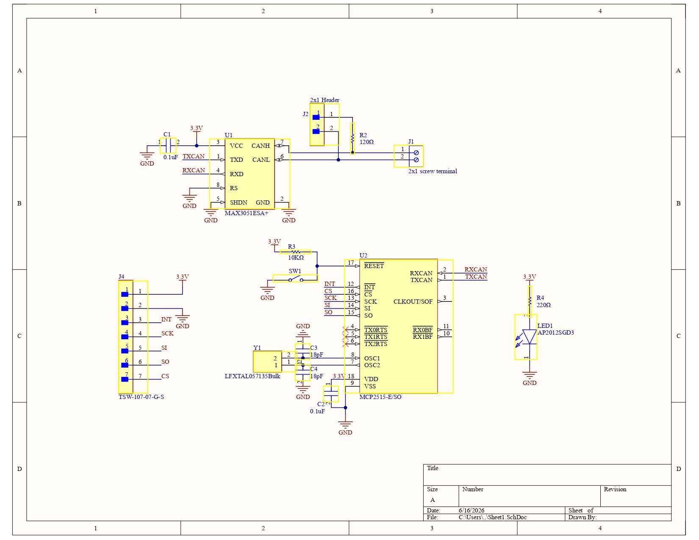
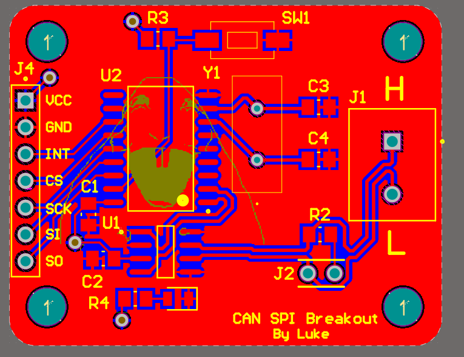
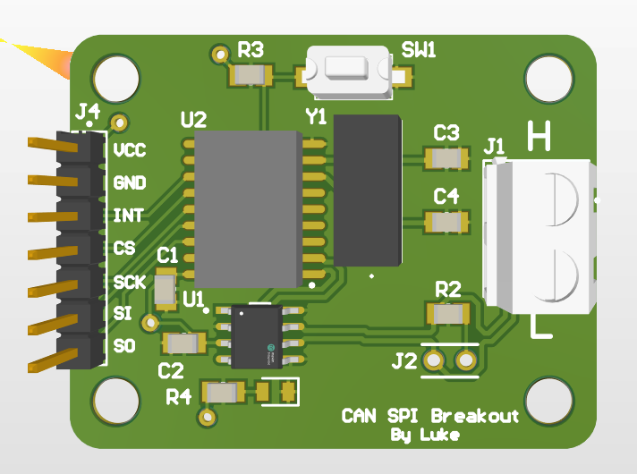

# CANbridge — SPI to CAN Converter
### SPI-to-CAN interface board enabling microcontrollers and development systems to communicate with CAN networks via MCP2515.

A compact 2-layer PCB that converts SPI communication to CAN bus, designed for off-robot subsystem testing for Sooner Competitive Robotics.

## Overview

Testing individual robot subsystems that communicate over CAN bus requires a reliable way to interface a development computer or microcontroller with the CAN network without the full robot platform present. CANbridge provides a simple, compact breakout that handles the SPI-to-CAN protocol conversion in one small board.

## Hardware

| Component | Part | Function |
|-----------|------|----------|
| CAN Controller | MCP2515 | SPI to CAN protocol conversion |
| CAN Transceiver | MAX3051 | CAN bus physical layer interface |
| Crystal | LFXTAL057135 | 8MHz clock for MCP2515 |
| Termination | 120Ω resistor | CAN bus line termination |

**Board dimensions:** 2" × 1"  
**Layers:** 2  
**Designed in:** Altium Designer

## Schematic

## PCB Layout

## Board Photo

## Design Decisions

**Compact form factor** — the board was intentionally kept to 2"×1" to minimize footprint on a test bench and keep it easy to integrate into existing test setups.

**120Ω termination resistor** — CAN bus requires termination at each end of the bus. A selectable termination resistor via header allows the board to function as either an endpoint or a mid-bus node depending on the test setup.

**SPI header** — a 7-pin header exposes all SPI signals (MOSI, MISO, SCK, CS, INT) plus power and ground, making the board directly compatible with most development boards and microcontrollers.

**Screw terminal CAN output** — a screw terminal was chosen for the CAN bus connection rather than a fixed connector to allow quick connection and disconnection during testing without soldering.

## Bring-Up Notes

Hand-soldered and validated using bench equipment. Prepared three boards to be used as general lab test equipment for individual hardware systems. 

## Tools

- Altium Designer
- MCP2515 SPI CAN controller
- Bench multimeter, oscilloscope, power supply
